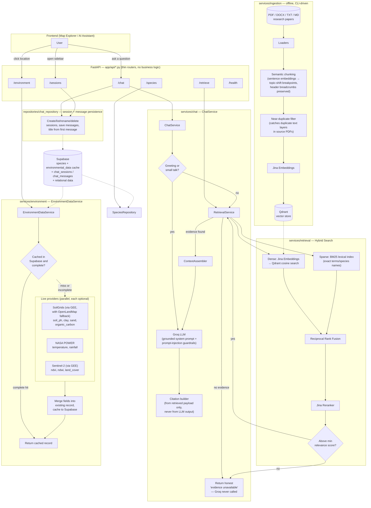

# AI-Based Climate-Resilient Tree Plantation Recommendation System

**Location-aware, evidence-grounded RAG system for tree plantation recommendations in Mandi Bahauddin, Punjab, Pakistan.**

This is not a generic plant-advice chatbot. Every recommendation is grounded in retrieved research documents and live environmental data for the exact coordinates queried — and the system is explicitly designed to say **"evidence unavailable"** rather than guess when it doesn't know something.

---

## Table of Contents

- [Why this exists](#why-this-exists)
- [Architecture](#architecture)
- [How a query actually works](#how-a-query-actually-works)
- [Chat history persistence](#chat-history-persistence)
- [Core design principles](#core-design-principles)
- [Tech stack](#tech-stack)
- [Project structure](#project-structure)
- [API reference](#api-reference)
- [Setup](#setup)
- [Ingesting documents](#ingesting-documents)
- [Chunk deduplication](#chunk-deduplication)
- [Evaluation](#evaluation)
- [Evaluation results](#evaluation-results)
- [Testing](#testing)
- [Known limitations](#known-limitations)
- [Changelog](#changelog)
- [Project status / roadmap](#project-status--roadmap)

---

## Why this exists

Generic AI plant-advice tools are tuned for global/US/EU conditions and answer everything confidently, whether or not they actually know. This system is scoped to a single district (Mandi Bahauddin) so it can be genuinely evidence-backed rather than broadly plausible, and it is built around one non-negotiable rule:

> **The LLM never answers from its own general knowledge. It only synthesizes what was actually retrieved.**

If the knowledge base has no relevant evidence for a question, the system says so — it does not fill the gap with a fluent-sounding guess.

---

## Architecture



---

## How a query actually works

**Example: "Which trees tolerate drought near Mandi Bahauddin?" with coordinates attached.**

1. **Greeting check** — a cheap, conservative phrase-list check (`is_greeting()`) filters out "hi"/"hello"/etc. so those skip retrieval entirely and get a short introduction from Groq instead of a forced Recommendation/Evidence/Sources structure.
2. **Hybrid retrieval**:
   - The query is embedded (Jina) and matched against Qdrant via cosine similarity — this is the **dense/semantic** half.
   - In parallel, a **BM25 lexical index** (built from the same corpus) scores the query for exact term/species-name matches — this is the **sparse/keyword** half.
   - Both ranked lists are combined via **Reciprocal Rank Fusion**, then the fused candidates are **reranked by Jina's cross-encoder** for final ordering.
   - Anything below `retrieval_min_relevance_score` is dropped. If nothing survives, retrieval raises `InsufficientEvidenceError` and **Groq is never called** — the API returns an honest "no evidence" message.
3. **Environmental context** — if coordinates were sent, `EnvironmentDataService` checks the Supabase cache first. A cached row is only trusted if its soil/vegetation fields are actually populated — a row cached while a provider was down (e.g. before the SoilGrids fix below) is treated as a partial miss and backfilled, not served as a false "complete" answer forever. On a real miss, it queries SoilGrids (via Google Earth Engine, with an OpenLandMap fallback), NASA POWER, and Sentinel-2 (via GEE) in parallel, merges whatever fields come back into the existing record, and caches the result. Missing fields are labeled `"not available from these sources"`, never guessed.
4. **Context assembly** — retrieved chunks and environmental data are formatted into two clearly-labeled blocks and marked as *untrusted data, not instructions* (the prompt-injection guardrail — a malicious/poisoned ingested document can't hijack the system prompt this way).
5. **Grounded generation** — Groq receives the system prompt (rules: use only supplied evidence, never invent citations/values, separate documented fact from AI recommendation, state uncertainty, flag conflicting evidence) plus the assembled context, and returns a structured answer.
6. **Citations** — built entirely from the retrieved chunks' payload metadata (title, source, year, URL, page), never from anything Groq generated.

---

## Chat history persistence

Every `/chat` request is now attached to a **session** so conversations survive a page reload and can be browsed, renamed, and deleted — the same shape as a typical chat sidebar. This sits alongside `ChatService` rather than inside it: `ChatService` still only does retrieval → context → Groq, and stays unaware that persistence exists. Saving messages and updating session metadata happens in the `/chat` router itself, then delegates to a small repository module — keeping the "thin router, business logic in services" rule intact while treating persistence as its own concern rather than folding it into the RAG pipeline.

**Schema** (`supabase/migrations`):

```sql
create table if not exists chat_sessions (
    id uuid primary key default gen_random_uuid(),
    user_id uuid,
    title text,
    created_at timestamptz not null default now(),
    updated_at timestamptz not null default now()
);

create table if not exists chat_messages (
    id uuid primary key default gen_random_uuid(),
    session_id uuid references chat_sessions(id) on delete cascade,
    role text not null,                     -- 'user' | 'assistant'
    content text not null,
    query_category text,
    evidence_available boolean,
    sources jsonb,
    created_at timestamptz not null default now()
);
```

**How a turn gets persisted** (`app/api/chat.py`):

1. If the request has no `session_id`, a new `chat_sessions` row is created first — so a chat always has somewhere to land, even on its very first message.
2. The user's message is saved immediately, before Groq is even called.
3. `ChatService.chat(...)` runs exactly as described above — retrieval, evidence check, generation.
4. The assistant's reply is saved, including `query_category`, `evidence_available`, and the raw source list — so a reloaded conversation renders identically to a live one (same evidence-available / no-evidence styling, same citations), not just the answer text.
5. The session's `title` is set once, from a truncated version of the very first user message, and left alone after that. `updated_at` is bumped on every turn so the session list can sort/group by recency.

**New endpoints** — see [API reference](#api-reference) below.

**Frontend** (separate repo — a React/Vite app): a collapsible sidebar (grouped by Today / Yesterday / Previous 7 days / etc., with search, inline rename, and delete) lists sessions from `GET /api/sessions`, loads a session's full history from `GET /api/sessions/{id}/messages` on click, and every chat message includes whatever `session_id` is currently active so later turns continue the same session instead of creating a new one each time.

---

## Core design principles

- **One interface per external dependency.** `LLMProvider`, `EmbeddingProvider`, `RerankerProvider`, `VectorStore`, `EnvironmentDataProvider` are all abstract base classes. Every concrete implementation (Groq, Jina, Qdrant, SoilGrids, NASA POWER, Sentinel-2) lives behind its interface. **`app/core/dependencies.py` is the single file that wires an interface to its implementation** — swapping any provider means writing one new class and changing one line there. This paid off directly: when ISRIC's SoilGrids REST API turned out to be down, adding a second GEE-backed provider behind the same `EnvironmentDataProvider` interface required no changes anywhere else in the codebase.
- **Routers are thin.** `app/api/*.py` files only translate HTTP ↔ service calls and map domain exceptions to status codes. No business logic lives in a router.
- **Never fabricate.** Null/missing fields render as `"Not available in current evidence"`. Modelled/estimated environmental values are explicitly labeled as estimates, never presented as field measurements. Retrieval failures return honest "unavailable" responses, not confident guesses.
- **Fail gracefully, not silently.** A broken provider (Groq, Jina, Qdrant, Supabase, a live environmental API) returns a clean `503` with a real reason — never a raw stack trace, and never a false "everything is fine."
- **Idempotent ingestion.** Chunk point-IDs in Qdrant are deterministic (`uuid5(document_id:chunk_index)`), and `IngestionPipeline` deletes a document's old chunks (`delete_by_metadata`) before upserting new ones — so re-ingesting the same file, or changing the chunking strategy entirely, never leaves orphaned stale chunks behind. A near-duplicate filter (see [Chunk deduplication](#chunk-deduplication)) runs before embedding, so a source PDF that happens to contain the same passage twice doesn't index it twice either.

---

## Tech stack

| Layer | Choice |
|---|---|
| API framework | FastAPI |
| LLM generation | Groq (OpenAI-compatible `chat/completions`) |
| Embeddings | Jina AI Embeddings |
| Reranking | Jina AI Reranker |
| Vector store | Qdrant |
| Lexical search | BM25 (`rank-bm25`), in-memory index over the Qdrant corpus |
| Relational data | Supabase (Postgres) — species, environmental cache, chat sessions/messages |
| Soil data | SoilGrids, via Google Earth Engine (OpenLandMap fallback) |
| Climate data | NASA POWER |
| Vegetation/land cover | Sentinel-2, via Google Earth Engine |
| Document parsing | `pypdf`, `python-docx` |
| Chunking | `langchain-text-splitters` (header-aware) + custom semantic breakpoint detection + near-duplicate filter |
| Testing | `pytest`, `pytest-asyncio`, in-memory fakes for every provider |

---

## Project structure

```
backend/
├── app/
│   ├── api/                 # thin routers: chat, retrieve, environment, species, sessions, health
│   ├── core/                 # config, dependency wiring, exceptions, logging, supabase client
│   ├── schemas/               # Pydantic request/response models (incl. session, message)
│   ├── repositories/           # Supabase table access (species, environmental_data, chat_repository)
│   └── services/
│       ├── llm/                    # LLMProvider interface + GroqProvider + system prompt
│       ├── embeddings/              # EmbeddingProvider interface + JinaEmbeddingProvider
│       ├── rerank/                   # RerankerProvider interface + JinaReranker
│       ├── vectorstore/               # VectorStore interface + QdrantVectorStore
│       ├── retrieval/                  # RetrievalService (hybrid fusion) + BM25Index
│       ├── ingestion/                   # loaders, semantic chunking, dedup, pipeline
│       ├── environment/                  # EnvironmentDataService + Soil/NASA/Sentinel providers + gee_client
│       ├── chat/                          # ChatService (retrieval → context → Groq)
│       ├── context/                        # prompt context assembly
│       ├── citations/                       # builds Source objects from retrieved payloads
│       └── query/                            # query classification, greeting detection
├── scripts/
│   ├── ingest.py                  # CLI document ingestion
│   ├── inspect_chunks.py           # dumps raw extraction + resulting chunks for one file, for debugging
│   ├── test_retrieval.py            # CLI retrieval smoke test
│   ├── seed_species.py               # seeds tree_species table
│   ├── verify_environment_providers.py # runs every env provider against real coordinates, prints raw results
│   └── evaluate_rag.py                  # RAG evaluation harness (Recall@K/Precision@K/MRR/citations)
├── data/
│   ├── raw/                  # source documents + .meta.json sidecars
│   └── eval/                  # golden_dataset.json
├── eval/
│   └── chunk_inspection/       # output of inspect_chunks.py — raw + chunked text dumps, gitignored
├── supabase/migrations/          # SQL schema
└── tests/                          # pytest suite + fakes for every provider
```

---

## API reference

| Endpoint | Method | Purpose |
|---|---|---|
| `/api/health` | GET | Per-service connectivity check (Groq, Jina, Qdrant, Supabase) |
| `/api/chat` | POST | Grounded conversational recommendation. Body: `{query, latitude?, longitude?, top_k?, session_id?}`. Persists the turn and returns `session_id` — omit it to start a new session, pass it back to continue one |
| `/api/retrieve` | POST | Raw hybrid retrieval, for debugging/evaluation. Body: `{query, top_k?, metadata_filter?}` |
| `/api/environment` | GET | Environmental data for a coordinate. Query params: `latitude`, `longitude` |
| `/api/species` | GET | List all seeded tree species |
| `/api/species/{id}` | GET | Single species detail |
| `/api/sessions` | GET | List chat sessions, most recently updated first |
| `/api/sessions` | POST | Create an empty session (used to pre-create one; not required — `/chat` creates one automatically if `session_id` is omitted) |
| `/api/sessions/{id}` | PATCH | Rename a session. Body: `{title}` |
| `/api/sessions/{id}` | DELETE | Delete a session (cascades to its messages) |
| `/api/sessions/{id}/messages` | GET | Full message history for a session |

All error responses use `503` for upstream-provider failures (with a real reason in `detail`), never a bare `500`.

---

## Setup

```bash
cd backend
python -m venv .venv
source .venv/bin/activate          # Windows: .venv\Scripts\activate
pip install -r requirements.txt
cp .env.example .env               # fill in real keys
```

**Required environment variables:**

```env
GROQ_API_KEY=
GROQ_MODEL=openai/gpt-oss-120b     # no "groq/" prefix — that's a routing convention, not the model ID
JINA_API_KEY=
QDRANT_URL=
QDRANT_API_KEY=
SUPABASE_URL=
SUPABASE_KEY=                      # service_role key, not anon/publishable — chat/session persistence writes directly, bypassing RLS
GEE_SERVICE_ACCOUNT_EMAIL=
GEE_SERVICE_ACCOUNT_KEY_PATH=./secrets/gee-key.json
```

SoilGrids and NASA POWER are free/public APIs — no key required. `GEE_SERVICE_ACCOUNT_KEY_PATH` should be an absolute path (or at least consistently resolved against the same working directory uvicorn is launched from) — a relative path silently breaks if the app is ever started from a different directory.

**Run:**

```bash
uvicorn app.main:app --reload
curl http://localhost:8000/api/health
```

---

## Ingesting documents

```bash
python scripts/ingest.py --path data/raw
```

Per-file metadata (title, source, year, topic) is set via a `<filename>.meta.json` sidecar next to each document:

```json
{
  "title": "Full Real Paper Title",
  "source": "Author et al. Year, Journal Name",
  "source_url": "https://doi.org/...",
  "year": 2022,
  "topic": "soil",
  "document_type": "research_paper"
}
```

**Set a real `title` here.** Citations, and every retrieval/evaluation metric that matches against expected source titles, depend on it — a missing `title` silently falls back to the filename, which breaks citation matching downstream.

Ingestion is safe to re-run: chunk IDs are deterministic and old chunks for a document are deleted before new ones are upserted, so re-ingesting after a chunking-strategy change (or a metadata fix) never leaves stale chunks behind.

---

## Chunk deduplication

Some source PDFs — observed in MDPI journal exports specifically — embed an earlier peer-review draft's text layer underneath the final typeset version. `pypdf` extracts both layers, so the same passage gets indexed twice, distinguishable only by a stray leftover page stamp (`"Agriculture 2022, 11, x FOR PEER REVIEW"` from the draft, vs. the real published `"Agriculture 2022, 12, 295"`). Found by inspecting one real paper's chunk output directly (`scripts/inspect_chunks.py`) — about 17% of that document's chunks were near-duplicates of other chunks in the same file.

The fix (`_dedupe_chunks` in `pipeline.py`) runs right after chunking, before any embedding calls are spent on chunks that would just get discarded:

- Compares chunk text **only within the same document** — never across different papers, so two papers that happen to phrase something similarly are never at risk of being treated as duplicates of each other.
- Uses text similarity (`difflib.SequenceMatcher`, threshold 0.85), not embedding similarity — the two copies are the *same underlying text*, differing only from being re-chunked slightly differently across the two draft layers, which is a text-matching problem, not a semantic one.
- A length pre-filter skips the expensive comparison for chunks whose lengths are too different to plausibly match, keeping this close to linear in practice.
- Keeps the first occurrence (lowest `chunk_index`), drops the rest.

To check a specific file's raw extraction and chunk output directly (e.g. after changing the chunker, or on a newly added PDF):

```bash
python scripts/inspect_chunks.py data/raw/your-file.pdf
```

Writes `eval/chunk_inspection/<filename>.raw.txt` (page-by-page raw extraction — check this first for column-order scrambling on two-column layouts) and `.chunks.txt` (every resulting chunk, post-dedup).

---

## Evaluation

```bash
python scripts/evaluate_rag.py 
```
After running above script it ask(1,3,5,10) i choose 10

Runs the 30-question golden dataset (`data/eval/golden_dataset.json`) against `/retrieve` and optionally `/chat`, reporting:

- **Recall@K / Precision@K / MRR** — retrieval quality
- **Evidence-available accuracy** — did the system correctly say "I don't know" for unanswerable questions, and correctly answer answerable ones
- **Citation correctness** — did the cited sources actually match the expected ones

---

## Evaluation results

Measured on the 30-question golden dataset, `top_k=10`.

| Metric | Before (vector-only, fixed-size chunking) | After (hybrid search + semantic chunking) | Change |
|---|---|---|---|
| Recall@K | 50.00% | 82.14% | +32.14 pts |
| Precision@K | 34.57% | 55.65% | +21.08 pts |
| MRR | 0.503 | 0.708 | +0.205 |

**"Before"** = pure dense retrieval (Jina embeddings → Qdrant cosine search → rerank) over fixed-size (800-char) chunks — the retrieval approach described in the original Phase 2 build.

**"After"** = the hybrid retrieval pipeline described in [How a query actually works](#how-a-query-actually-works) — dense + BM25 lexical search fused via Reciprocal Rank Fusion, then reranked — over semantically-chunked text (topic-shift breakpoints instead of fixed character counts).

Why this direction of improvement makes sense, not just that it happened:
- **BM25's contribution** is largest on queries built around exact species names and numeric figures (e.g. "Eucalyptus camaldulensis," "388 mm," "2673 km²") — dense embeddings alone can under-rank a chunk that's an exact textual match but only a middling semantic match to a paraphrased question; lexical search catches those directly.
- **Semantic chunking's contribution** is that a chunk boundary now falls at an actual topic shift instead of an arbitrary character count, so a chunk is less likely to dilute a strong match with an unrelated adjacent sentence, which is the direct mechanism by which it should raise precision specifically.
- Recall@K improving more than Precision@K is the expected shape for adding a second retrieval signal (BM25) that surfaces relevant chunks dense search alone missed — this widens the correct pool of candidates that make it into top-K.

This isn't an isolated benchmark — the deduplication fix in the section above also feeds into these numbers indirectly by keeping near-duplicate chunks from crowding out genuinely different relevant chunks within the same top-K slots.

---

## Testing

```bash
pytest -v
```

Every provider (Groq, Jina, Qdrant, Supabase, SoilGrids, NASA POWER, Sentinel-2) has a fake implementation in `tests/fakes.py`, so the full test suite runs with no network access and no real credentials.

---

## Known limitations

Stated explicitly, because this project's whole premise is not overstating what it knows:

- **Evidence is district-level, not sub-district.** Retrieved documents aren't geo-tagged to specific points within Mandi Bahauddin, so two different map clicks get different *environmental* data but the same retrieved *evidence*.
- **NASA POWER's native resolution (~55km × ~70km) is coarser than the entire district** — temperature/rainfall will read identically across the whole district. This is a real dataset limitation, not a bug.
- **Google Earth Engine requires a registered project + service account** — more setup than SoilGrids/NASA POWER, which need no auth at all.
- **The knowledge base only knows what's been ingested.** A well-formed question about a topic with no ingested evidence correctly returns "insufficient evidence," not a general-knowledge answer.
- **ISRIC's SoilGrids REST API is currently non-functional** (see Changelog) — kept in the provider chain so it resumes contributing automatically if restored, but the GEE-backed provider is what actually serves soil data today.
- **The near-duplicate chunk filter is a heuristic, not a guarantee.** Two genuinely different passages that happen to be very similarly worded (unlikely, but not impossible in dense scientific writing) could in principle be over-merged; the 0.85 threshold was chosen to tolerate the specific draft-layer duplication pattern observed, not derived from a broader study.
- **Chat sessions are not scoped to a user yet.** `chat_sessions.user_id` exists in the schema, but there's no auth wired in to populate it — every client currently sees and can rename/delete every session. Fine for single-user/demo use; not safe to deploy multi-tenant as-is.

---

## Changelog

Notable fixes made during development, kept here because the reasoning matters for anyone debugging something similar later.

- **Chat history persistence added.** New `chat_sessions` / `chat_messages` Supabase tables, a `chat_repository` module for all reads/writes, and a `/api/sessions` router (list/create/rename/delete/history). `/api/chat` now creates or continues a session on every turn, persists both sides of the conversation (including sources and evidence-available state, not just the answer text), and titles a session from its first message. Kept out of `ChatService` deliberately — persistence lives in the router layer so the RAG pipeline itself stays unaware sessions exist.
- **SoilGrids REST API found to be non-functional.** ISRIC paused the service (`rest.isric.org`) with no restoration ETA. Root-caused by testing directly against the live endpoint rather than assuming a parsing bug — the original `SoilGridsProvider`'s parsing logic was actually already correct. Added `SoilGridsGEEProvider` (same underlying SoilGrids v2.0 data, via Earth Engine) as the provider that now actually serves requests, with a per-field OpenLandMap fallback for any field the primary GEE asset returns empty for. Unit conversions differ between the two fallback sources (SoilGrids reports clay/sand in g/kg, OpenLandMap reports them directly in %) and are applied per-source, not with one shared divisor, to avoid silently producing wrong values.
- **Dependency-wiring bug fixed.** A merge error left two conflicting definitions of `get_environment_service()` in `dependencies.py`; the one Python actually used called `EnvironmentDataService(providers)` positionally against a keyword-only constructor, causing every `/environment` request to 500. Fixed by restoring the codebase's actual convention (`@lru_cache` singletons constructed directly, not FastAPI `Depends()`, below the router layer).
- **Environmental cache backfill fixed.** A location cached while a provider was down (e.g. before the GEE fix above) was being served as a permanently "complete" result even after the provider started working. `EnvironmentDataService` now treats a cached row as a partial miss if its soil/vegetation fields are all null, re-queries live providers, and merges new values into the existing row rather than trusting a stale null forever.
- **Ingestion near-duplicate filter added.** See [Chunk deduplication](#chunk-deduplication) above.

---

## Project status / roadmap

| Phase | Status |
|---|---|
| 1 — Foundation (config, health checks, provider interfaces) | Done |
| 2 — RAG core (ingestion, hybrid retrieval) | Done |
| 3 — Groq generation (grounded chat) | Done |
| 4 — Supabase structured data (species, environmental cache) | Done |
| 5 — Live environmental data (SoilGrids/NASA POWER/Sentinel-2) | Done |
| 6 — Frontend | Not in this repo |
| 7 — Integration | Pending frontend |
| 8 — RAG evaluation harness | Done |
| 9 — Deployment | Not started |

Remaining backend gaps: `/api/documents` CRUD, `/api/location`, auth/user scoping for chat sessions, feedback endpoints.